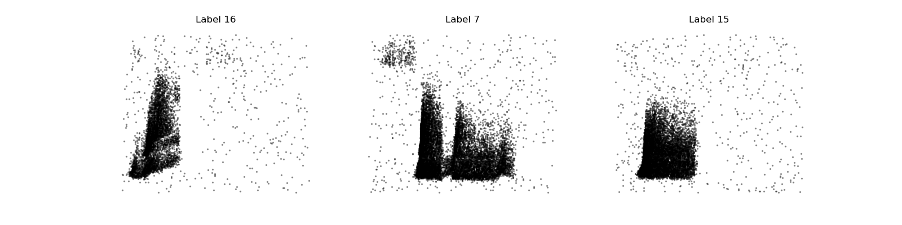

# Project 2: *Machine Learning approaches for finding structure in neural data*

If you followed the steps above, you should have everything set up and running. To ensure everything is setup properly run `test_loader.py`. If it works properly, it should output something similar to the figure below:

---

### Tutorial & Examples

Once you have everything set up and running, go through the tutorial notebook [tutorial_example.ipynb](tutorial_example.ipynb).
Examine it carefully. There are a set of tools provided that already implement relevant functionality. Try to understand the
use of the `SpikeList` and `StateMatrix` classes in the examples and check the source code (in `tools/analysis/`) as these 
comprise a lot of potentially useful metrics and methods.

### Project

The tutorial ends with the application of Principal Component Analysis (PCA) to the dataset. A natural extension is the application
of different dimensionality reduction and manifold learning algorithms. In the project presentation and below, 
I leave some suggestions for algorithms you may want to try:

1. Principal Component Analysis (PCA)
2. Multi-Dimensional Scaling (MDS)
3. Isomap Embedding
4. Locally Linear Embedding (LLE)
5. Laplacian Eigenmaps (LEM) or Spectral Embedding
6. t-distributed Stochastic Neighbour Embedding (t-SNE)
7. Uniform Manifold Approximation and Projection (UMAP)

Ideally, you should compare their performance looking at, for example, the ability to reconstruct the original states
from the embedding, or the ability to classify the different label identities from the embedding. Some useful metrics you can use:
- Mean Squared Error between original data and reconstruction
- Accuracy of a classifier trained on the embedding, compared to the accuracy obtained on the original dataset
  - **NOTE:** If you have doubts about which classifier is suitable (or which ML algorithm applies to your data), consult [this guide](https://scikit-learn.org/1.3/tutorial/machine_learning_map/index.html)
- [Trustworthiness](https://scikit-learn.org/stable/modules/generated/sklearn.manifold.trustworthiness.html) is a useful metric for this purpose (although I'm not sure if it applies to all methods) 

---

There are some additional methods that are variants of common ML methods, derived in the context of neural data and may yield interesting insights:
1. demixed Principal Component Analysis ([dPCA](https://pypi.org/project/dPCA/))
2.  Gaussian Process Factor Analysis ([GPFA](https://github.com/harvineet/py-gpfa/blob/master/GPFA_sampling.ipynb))
3. Switching Linear Dynamical System ([SLDS](https://slinderman.github.io/stats320/labs/07_slds.html))

Also, you can check a nice summary of these methods and their application in [this paper](https://www.nature.com/articles/nn.3776).
