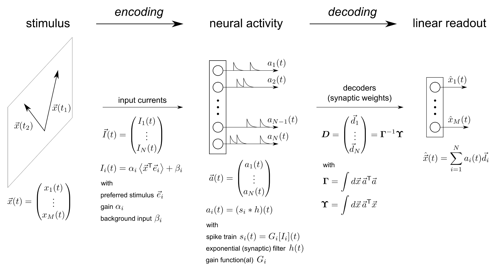
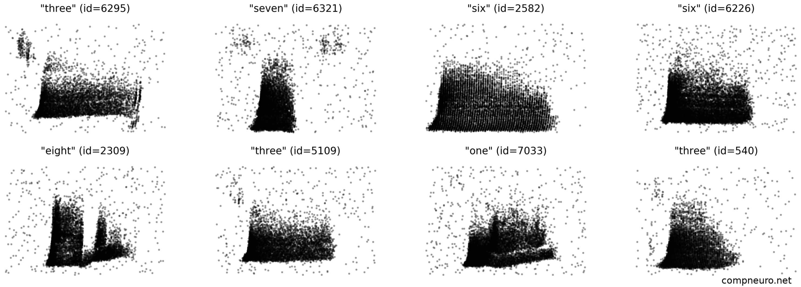

# 2025 Summer School in Computational Biology @ UC

## Group Projects in *Computational Neuroscience*
See descriptions in [Projects Presentation](https://slides.com/renatocfduarte/cnc-template-e1c351/fullscreen?token=Pdo2XW2E).

### Project 1: *Dynamics, representation and processing memory in networks of spiking neurons*

In this project, you will create a small computational experiment to drive a population of spiking neurons with a structured input and analyse the resulting dynamics and representations. To achieve this, we will create a simple input signal, encode it as input currents to drive a pool of spiking neurons, record and process their responses and train a linear decoder to extract information from this mapping. In essence, the figure below summarizes the process.



The aim of the project is then to explore different variants of tasks, neuron and synapse models, network architectures and plasticity rules and determine their impact in task performance. It is highly exploratory, so we encourage you to think (with your group and supervisor) about a concrete hypothesis you would like to explore before moving to the full implementation. 

To simplify the process, we recommend using the [NEST Simulator](https://nest-simulator.org/), but you are welcome to use any other numerical simulation tool or manually implement your own models (although given the duration of the project, this is not a good option). Alternative software that are good options for this task: [Brian](https://brian2.readthedocs.io/en/stable/), [JAXley](https://jaxley.readthedocs.io/en/latest/), [Spytorch](https://github.com/fzenke/spytorch) or [Nengo](https://www.nengo.ai/).

While Brian is very similar in design and philosophy to NEST, JAXley and Spytorch are more focused on the application of gradient-based optimization methods to biophysical models (JAXley) of spiking neural networks or to train SNNs with supervised learning (Spytorch). You are welcome to play around and try these different options, but we recommend NEST as the main tutorials use it and it is the simplest to get started with. However, the installation of NEST can be a bit tricky, so we recommend using JAXley if you run into serious problems. 

The first task is to install and test the simulation software you will use throughout the project.


### Project 2: *Machine Learning approaches for finding structure in neural data*
In this project, you will be analyzing a synthetic dataset which represents the activity of auditory cochlear cells when stimulated by specific auditory input. 
The dataset was designed as a machine learning benchmark for spiking neural networks, but we will be
using a sub-set of it as an example of (clearly structured) neural population activity. The whole dataset, along with its purpose and how it was generated is documented [here](https://ieeexplore.ieee.org/document/9311226) and openly available [here](https://zenkelab.org/resources/spiking-heidelberg-datasets-shd/). We will focus on the spoken digit recognition sub-set, comprising audio recordings of spoken single digits 
fed through a hydrodynamic basilar membrane (BM) model and subsequently converted to phase-coded spikes with a transmitter-pool based hair cell (HC) model. This pre-processing pipeline was designed to mirror the encoding of auditory information by the Hair Cells of the cochlear nucleus. The resulting spiking activity of a population of 700 cochlear cells is depicted below.



We will be using (a small sub-set of) this dataset to analyse encoded representations in distributed population activity. The aim of the project is to analyse the geometry of neural representations. In that sense, this dataset is very adequate, as there are clearly discernible spatiotemporal patterns in the activity of the (emulated) cochlear neurons. 


### **Preliminaries:** Setting up project requirements and libraries

#### 1) Cloning the repository
This repository contains all you will need to work on the project. So, start by cloning it:
```shell
git clone git@github.com:CNNC-Lab/computational-biology-2025.git
```

If you have never worked with `git` or are unfamiliar with it, have a quick look at this [short introduction](https://docs.github.com/en/get-started/getting-started-with-git/set-up-git). You can also use the Desktop IDE for GitHub, which makes the process of using repositories much easier (see [here](https://desktop.github.com/)).

**Note:** If you run into any trouble or are unable to clone the repository, please try to discuss with your colleagues that may be more experienced with git or contact the course tutor.


#### 2) Setting up a virtual environment
As the project requires some specific libraries, it is recommended that you setup a [conda](https://docs.anaconda.com/) virtual environment. If you are unfamiliar with the notion of virtual environments, don't get scared, all you will need to set it up is provided in the repository:

Install conda via the link above and create a new project environment:

```shell
conda env create -f conda_venv.yml
```

Don't forget to load it and activate it before running the code:
```shell
conda activate computational-biology-2024
```

### Project-specific preparations 

For more detailed instructions for your specific project, consult the respective document:
- [Project 1](PROJECT1.md)
- [Project 2](PROJECT2.md)

